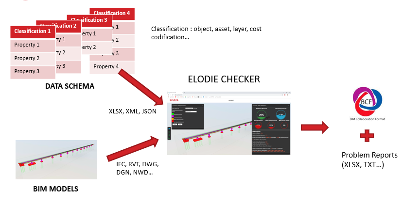

# ELODY

## Summary

1. [Introduction](#introduction)
2. [Technologies](#technologies)
3. [Data Schema](#data-schema)
   1. [Excel Tabs](#excel-tabs)
   2. [Rules](#rules)
   3. [File Data Tab](#file-data-tab)
      1. [Filename](#filename)
      2. [Levels](#levels)
      3. [IfcProject](#ifcproject)
      4. [IfcSite](#ifcsite)
      5. [IfcBuilding](#ifcbuilding)
      6. [Project Information](#project-information)
      7. [Unit](#unit)
   4. [Generic Properties Tab](#generic-properties-tab)
   5. [Classification](#classification)
   6. [Geo Markers](#geo-markers)
4. [Examples](#examples)

## Introduction

ELODY is a web application to control the data in BIM (Building Information Modeling) Models. The control is based on a data schema given by the user and exports can be done to the following formats: Excel and [BCF](https://en.wikipedia.org/wiki/BIM_Collaboration_Format).



**Where we are:**

- In most of our BIM Models delivery, focus is made on design/modeling, but BIM Models additional value is about data
- No tool/process dedicated to the quality of data for BIM Models (Manual Checking/Massive Export to Excel/ad hoc development on modeling software)
- Designers are responsible of the data provided in BIM objects but in most of the case they are not the ones in charge of implementing the data and the checking too…
- Ensure the compliance of Data Schema and Objects Classifications defined in the AIR/EIR (Asset Information Requirements/Employer Information Requirements) or BEP (BIM Execution Plan)

**What we need:**

- Provide to designers an easy-to-use tool to check data quality of BIM Models : different from a production/modeling tool, web-application => accessible through an internet browser
- Multiple file format compatible : IFC, RVT, DWG, DGN, NWD…
- Help client/designer to control the quality of BIM deliverables to enhance the use of BIM Models (Cost Estimation, BOQ, Opex, etc)

## Technologies

ELODY is a web application based on the following technologies:

- Frontend: [React](https://fr.reactjs.org/) [Typescript](https://www.typescriptlang.org/)
- Backend: [Node JS](https://nodejs.org/en/)

Both Backend and FrontEnd used [Autodesk Forge](https://forge.autodesk.com/) APIs and Viewer.

## Data Schema

This section will describe the way to define data schema in the Excel configuration file.

### Excel Tabs

The Excel tabs in the configuration file have different scopes according to their name.

| Tab Name       | Description                                                                                   |
| -------------- | --------------------------------------------------------------------------------------------- |
| FILE DATA      | Data schema for file data verification (filename and/or levels)                               |
| GEN\*          | All Tabs starting with "GEN" will be general rules applied to all the objects                 |
| CLASSIFICATION | Properties and rules by project classification                                                |
| GEO MARKER     | Geo Markers to add in the model to check georeferencing                                       |
| +\*            | All Tabs starting with "+" will be extra information and won't be taken into account by eLODy |

_A\* all tabs starting with "A"_

The details of the content of all the tabs will be given in the next paragraphs.

### Rules

The syntax for the rules are the following:

| Rule         | Description                                                     |
| ------------ | --------------------------------------------------------------- |
| no rule      | Checking if the property exists and has value (non blank value) |
| =A           | Checking if the data value is equal to A                        |
| !=A          | Checking if the data value is different from A                  |
| \>10         | Checking if the value is superior to 10                         |
| <10          | Checking if the value is inferior to 10                         |
| A\*          | Checking if the value starts with A                             |
| \*A          | Checking if the value ends with A                               |
| \*A\*        | Checking if the value includes A                                |
| \[A;B;C;D;E] | Checking if the given list contains the value                   |
| /^a$/g       | [Regular expressions](https://regexr.com/) (here if value is a) |

### File Data Tab

Here is the details to create checking rules for file data information.

#### Filename

In order to check the filename, please follow the example below:

| Properties | Rule1                            |
| ---------- | -------------------------------- |
| Filename   |
| Separator  | \_                               |
| ID_CLIENT1 | =PN1539                          |
| ID_CLIENT2 | =17                              |
| ID_CLIENT3 | =EXE                             |
| ID_CLIENT4 | =MOD                             |
| ID_CLIENT5 | /^\[0-9]{6}$/g                   |
| ID_CLIENT6 | \[01;02;03;04;05;06;07;08;09;10] |
| ID_CLIENT7 | \[01;02;03;04;05;06;07;08;09;10] |
| ID_CLIENT8 | =09BVC                           |
| ID_CLIENT9 | \[ACC;ACO;AMG]                   |

Properties and Rule1 have to be placed in the first line of the tab. Filename and all the ID_CLIENTX can be placed on all the lines of FILE DATA tab.

The separator is the character to use to split the filename in different parts. ID_CLIENTX is the part to check inside the filename.

For now, only one rule can be applied by filename part.

#### Levels

In order to check the filename, please follow the example below:

| Properties        | Rule1                                                        |
| ----------------- | ------------------------------------------------------------ |
| Levels            |
| ExactMatch Option | 1                                                            |
| Level Name        | [NTT;N01;N00;S01-1;S01;S02;S03;S04;N-Ref;Zra]                |
| Level Elevation   | [93,12;89,54;85,22;77,7;77,22;69,22;62,18;59,78;62,18;61,08] |

Properties and Rule1 have to be placed in the first line of the tab. Levels and options can be placed on all the lines of FILE DATA tab.

The exact match option (0 or 1) allows to check for the exact elevation for a specific name. Of course, level name and level elevations tabs must have the same length.

#### IfcProject

This check will only be performed if input file is IFC. In order to check the properties of IfcProject, please follow the example below:

| Properties | Rule1            |
| ---------- | ---------------- |
| IFCPROJECT |
| NAME       | Autodesk Revit\* |
| VERSION    | =2019            |

Properties and Rule1 have to be placed in the first line of the tab. IfcProject and their properties can be placed on all the lines of FILE DATA tab.

#### IfcSite

This check will only be performed if input file is IFC. In order to check the properties of IfcSite, please follow the example below for IfcBuilding:

| Properties           | Rule1 |
| -------------------- | ----- |
| IFCSITE              |
| RefLatitude_Degrees  |
| RefLatitude_Minutes  |
| RefLatitude_Seconds  |
| RefLongitude_Degrees |
| RefLongitude_Minutes |
| RefLongitude_Seconds |

N.B.: "NAME" property will verify the IfcBuilding name of the IFC Schema.

Properties and Rule1 have to be placed in the first line of the tab. IfcSite and their properties can be placed on all the lines of FILE DATA tab.

#### IfcBuilding

This check will only be performed if input file is IFC. In order to check the properties of IfcBuilding, please follow the example:

| Properties           | Rule1                                                                                       |
| -------------------- | ------------------------------------------------------------------------------------------- |
| IFCBUILDING          |
| NAME                 | Gare de BVC                                                                                 |
| Nom du marché        |
| Nom du bâtiment      |
| Spécialité           |
| Phase                | =EXE                                                                                        |
| Ligne SGP            |
| Ouvrage SGP          | =09BVC                                                                                      |
| Intergare SGP        | [14XIL;13XIL;12XIL;11XIL;10XIL;09XIL;08XIL]                                                 |
| Tunnel SGP           | [15T01;14T02;14T01;14TSM;13T02;13T01;12T01;11T02;11T01;10T02;10T01;09T01;08T02;08T01;08TSM] |
| Date de fin de phase |
| Nom du client        | =Société du Grand Paris                                                                     |
| Adresse du projet    |

N.B.: "NAME" properties will verify the IfcBuilding name of the IFC Schema.

Properties and Rule1 have to be placed in the first line of the tab. IfcBuilding and their properties can be placed on all the lines of FILE DATA tab.

#### Project Information

This check will only be performed if input file is RVT. In order to check the properties of Project Information, please follow the example below:

| Properties           | Rule1                                                                                       |
| -------------------- | ------------------------------------------------------------------------------------------- |
| PROJECTINFORMATION   |
| Nom du marché        |
| Nom du bâtiment      |
| Spécialité           |
| Phase                | =EXE                                                                                        |
| Ligne SGP            |
| Ouvrage SGP          | =09BVC                                                                                      |
| Intergare SGP        | [14XIL;13XIL;12XIL;11XIL;10XIL;09XIL;08XIL]                                                 |
| Tunnel SGP           | [15T01;14T02;14T01;14TSM;13T02;13T01;12T01;11T02;11T01;10T02;10T01;09T01;08T02;08T01;08TSM] |
| Date de fin de phase |
| Nom du client        | =Société du Grand Paris                                                                     |
| Adresse du projet    |

Properties and Rule1 have to be placed in the first line of the tab. Project Information and their properties can be placed on all the lines of FILE DATA tab.

#### Unit

In order to check the unit of the model, please follow this example:

| Properties | Rule1 |
| ---------- | ----- |
| Unit       | =m    |

Properties and Rule1 have to be placed in the first line of the tab. Unit and its rule can be placed on all the lines of FILE DATA tab.

### Generic Properties Tab

In order to check properties for all the object of a model, please follow this example:

| Properties              | Rule1                                          | Rule2 | Rule3    | Rule4  |
| ----------------------- | ---------------------------------------------- | ----- | -------- | ------ |
| SGP_DI_Sous_Ouvrage     | \*09BVC\*                                      | \*B\* | \*XXXX\* | \*00\* |
| SGP_DI_Ouvrage          | =09BVC                                         |       |          |
| SGP_DI_Batiment         | =B                                             |       |          |
| SGP_DI_Niveau           | \[NTT;N01;N00;S01-1;S01;S02;S03;S04;N-Ref;Zra] |       |          |
| SGP_DI_Typologie_Espace | \[ABVE;ACAS;ACCU;ACFA;ACHA]                    |       |          |
| SGP_DI_Incrementation   | /^\[0-9]{2}$/g                                 |       |          |

Properties and RuleX have to be placed in the first line of the tab.

### Classification

In order to check the properties of each class of project classification, please follow this example:

| Uniclass2015   | Properties          | Rule1                                       | Rule2   |
| -------------- | ------------------- | ------------------------------------------- | ------- |
| Ss_20_05_65    | ClassifName         |                                             |
| Ss_20_05_65    | WBS_Code            | HS2\*                                       | \*PIL\* |
| Ss_20_05_65    | CBS_Code            | HS2\*                                       | \*PIL\* |
| Ss_20_05_65    | Reinforcement Ratio | \*kg/m3\*                                   | >100    |
| Ss_20_05_65    | Grade_Mix           | C\*                                         |
| Ss_20_05_65    | Volume              | <100                                        |
| Ss_20_05_65    | Length              | <100                                        |
| Ss_20_05_65    | Section Name        |                                             |
| Ss_20_05_65    | Layer               | =CB-Ss_20_05_65-M_PilesConcreteInsitu       |
|                |                     |
| Ss_20_05       | ClassifName         |                                             |
| Ss_20_05       | WBS_Code            | HS2\*                                       | \*GSL\* |
| Ss_20_05       | CBS_Code            | HS2\*                                       | \*GSL\* |
| Ss_20_05       | Layer               | =CB-Ss_20_05-M_Blinding                     |
| Ss_20_05       | Reinforcement Ratio | \*kg/m3\*                                   |
| Ss_20_05       | Grade_Mix           | C\*                                         |
| Ss_20_05       | Volume              |                                             |
| Ss_20_05       | Section Name        |                                             |
| Ss_20_05       | Material            |                                             |
|                |                     |
| Ss_20_05_15_71 | ClassifName         |                                             |
| Ss_20_05_15_71 | WBS_Code            | HS2\*                                       | \*PLC\* |
| Ss_20_05_15_71 | CBS_Code            | HS2\*                                       | \*PLC\* |
| Ss_20_05_15_71 | Layer               | =CB-Ss_20_05_15_71-M_PilecapsConcreteInsitu |
| Ss_20_05_15_71 | Reinforcement Ratio | \*kg/m3\*                                   |
| Ss_20_05_15_71 | Grade_Mix           | C\*                                         |
| Ss_20_05_15_71 | Volume              |                                             |
| Ss_20_05_15_71 | Thickness           |                                             |

Properties and RuleX have to be placed in the first line of the tab.

The classification parameter name have to be in first line and first column.

Possible Classification Values have to be set with ClassifName in Properties.

### Geo Markers

In order to place geomarkers in the model to check the georeferencing, please follow this example:

| X           | Y           | Z     |
| ----------- | ----------- | ----- |
| 1665232,471 | 8180535,021 | 62,18 |

## Example

Example file and parameter can be found in this SharePoint folder: [Examples](https://systragroup.sharepoint.com/:f:/r/sites/Forge/Documents%20partages/eLODy/Examples?csf=1&web=1&e=Mpo6tJ)

## Installation

### Development

#### Mongo DB on Docker

```bash
docker-compose -f docker-compose.yml -f docker-compose-dev.yml up -d mongo mongo-express
```

#### Backend (server folder)

In order to launch the backend for the development, please follow:

```bash
npm install
npm start
```

#### Frontend (client folder)

In order to launch the frontend for the development, please follow:

```bash
npm install
npm start
```

Automatically, React will use the environment variables defined in .env and .env.development.

### Production

#### Connection to server

Use [MobaXterm](https://mobaxterm.mobatek.net/)

Remost host: vldfr010frg191 (Port 22)

Go to public folders, then elody folder:

```bash
cd /var/www
sudo su
cd elody
```

#### Update from Git repo

To check git status, load last updates and give public access to modified/created files

```bash
git status
git pull
chown -R svc_elody: /var/www/elody
```

If conflit, use git stash:

```bash
git stash
git pull
chown -R svc_elody: /var/www/elody
```

#### Shared

```bash
cd /var/www/elody/shared
rm -rf build/
sudo -u svc_elody npm install --cache /var/www/elody/.npm/ --prefix /var/www/elody/shared/
sudo -u svc_elody npm run build --cache /var/www/elody/.npm/ --prefix /var/www/elody/shared/
chown -R svc_elody: /var/www/elody
```

#### Server

Restart server service:

```bash
cd /var/www/elody/server
systemctl stop elody-server.service
rm -rf build/
sudo -u svc_elody npm install --cache /var/www/elody/.npm/ --prefix /var/www/elody/server/
sudo -u svc_elody npm run build --cache /var/www/elody/.npm/ --prefix /var/www/elody/server/
chown -R svc_elody: /var/www/elody
systemctl start elody-server.service
```

To Log Service Status (last 1000 lines)

```bash
journalctl -u elody-server.service -fn 1000
```

#### Client

Stop client service and delete build:

```bash
cd /var/www/elody/client
systemctl stop elody-client.service
rm -rf build/
sudo -u svc_elody npm install --cache /var/www/elody/.npm/ --prefix /var/www/elody/client/
sudo -u svc_elody npm run build --cache /var/www/elody/.npm/ --prefix /var/www/elody/client/
chown -R svc_elody: /var/www/elody
systemctl start elody-client.service
```

If fsevents error :

```bash
 sudo -u svc_elody npm install fsevents@latest -f --save-optional --cache /var/www/elody/.npm/ --prefix /var/www/elody/client/
```

<!-- If node-sass error (n): npm without sudo su

Give access before start service:

```bash
chown -R svc_hq_run_elody01:www-data elody
``` -->
